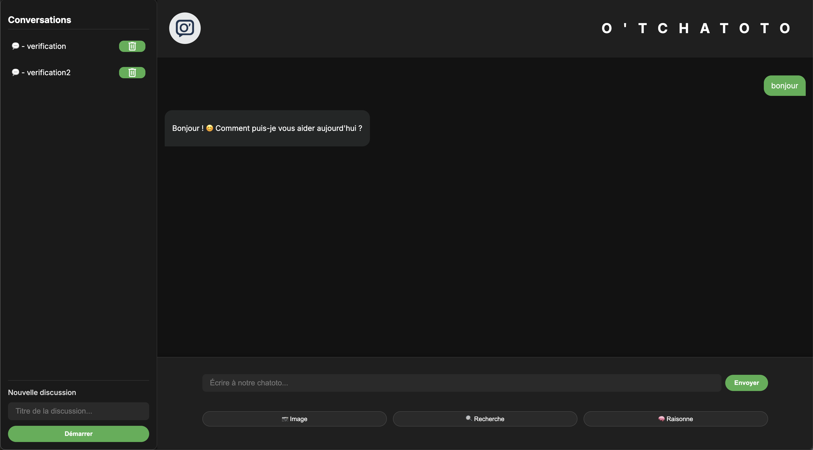
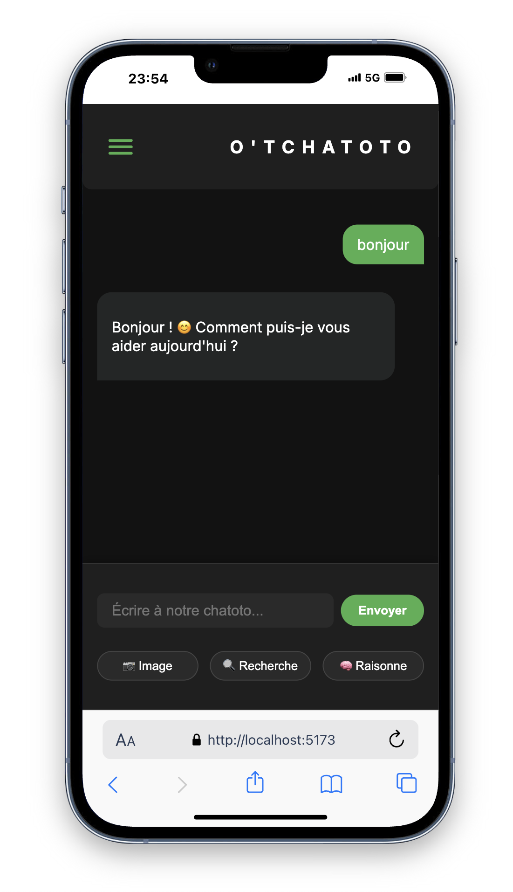

# 🚀 O'Tchatoto – Application de Chat IA avec SvelteKit & Pocketbase

> _O'Tchatoto_ est une application moderne de chat alimentée par **Mistral AI**, conçue avec **SvelteKit** et **Pocketbase** pour gérer les conversations de manière fluide, rapide et élégante.

---

## 🧠 Fonctionnalités principales

| Fonction                         | Description                                                     |
| -------------------------------- | --------------------------------------------------------------- |
| 💬 **Chat IA Mistral**           | Envoie un message et reçois une réponse instantanée de l’IA.    |
| 📂 **Gestion des conversations** | Crée, sélectionne ou supprime une discussion facilement.        |
| 🧾 **Historique persistant**     | Sauvegarde automatique des messages via Pocketbase.             |
| 🖍️ **Affichage Markdown**        | Les réponses sont formatées proprement (titres, listes, code…). |
| 📱 **Responsive**                | Interface 100 % adaptée aux écrans mobiles et desktop.          |

---

## 🛠️ Stack technique

- 🧩 **SvelteKit** – Front-end ultra-rapide & modulaire
- ⚡️ **Pocketbase** – Backend local & léger pour stocker les données
- 🧠 **Mistral API** – Génération de réponses intelligentes par IA
- 🧾 **svelte-exmarkdown** – Rendu Markdown avancé dans les réponses

---

## 📁 Structure du projet

```bash
my-app/
├── static/
│   ├── image/
│   │   ├── Logo-O'Tchatoto.png
│   │   └── favicon.png
├── src/
│   ├── lib/
│   │   └── components/
│   │       ├── Header.svelte
│   │       └── Footer.svelte
│   ├── routes/
│   │   └── +page.svelte
│   └── app.html
├── README.md
├── .env.template
└── svelte.config.js
```

## 📦 Installation

#### **1. Cloner le dépôt**

```bash
git clone https://github.com/Thomasbrelot/O-Tchatoto.git
cd O-Tchatoto
```

#### **2. Installer les dépendances**

```bash
npm install
```

#### **3. Configurer l’environnement**
   Crée un fichier .env à la racine du projet :

```bash
VITE_KeyApiMistral=ta_clé_api_mistral
```

#### **4. Lancer Pocketbase**

- Télécharge Pocketbase : https://pocketbase.io/

- Lance-le avec :

```bash
./pocketbase serve
```

Cela ouvre un backend local sur http://127.0.0.1:8090.

#### **5. Démarrer l’app**

```bash
npm run dev
```

- Accède ensuite à http://localhost:5173

### 📸 Aperçu de l'application





# ✨ À propos

Ce projet a été réalisé dans le cadre d’un exercice front-end avec SvelteKit, pour démontrer :

- une bonne maîtrise des composants,

- l’intégration d’un backend local simple (Pocketbase), et la consommation d’une API IA (Mistral).
